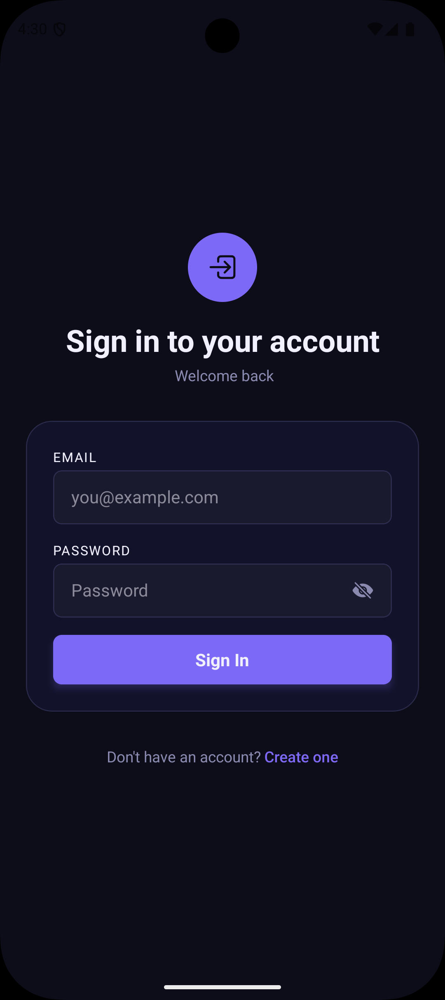
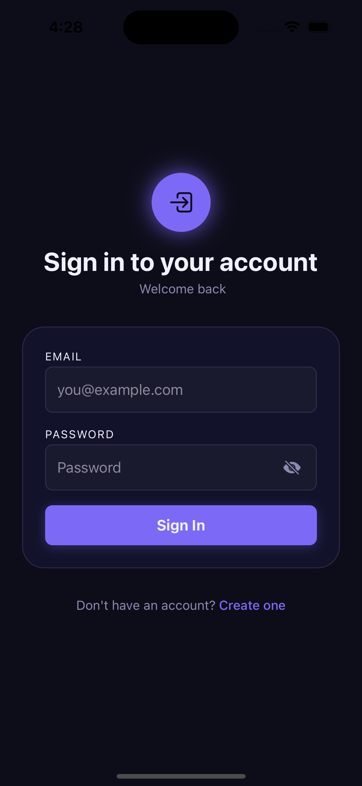
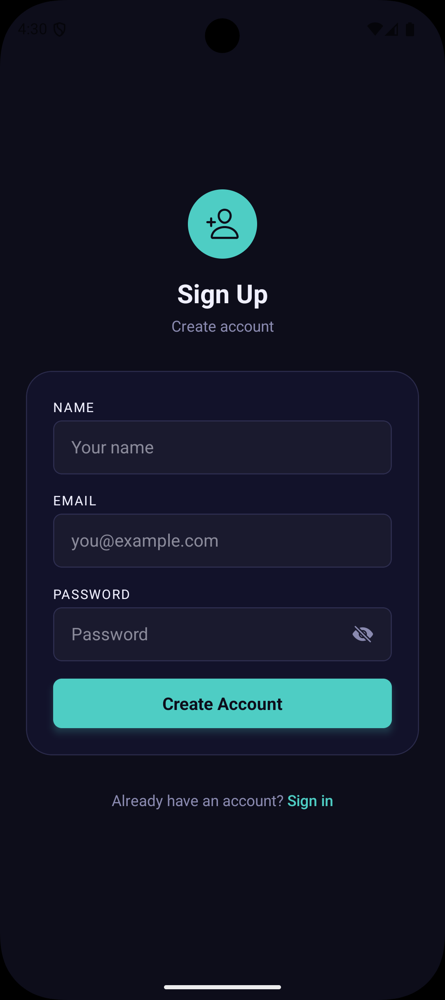
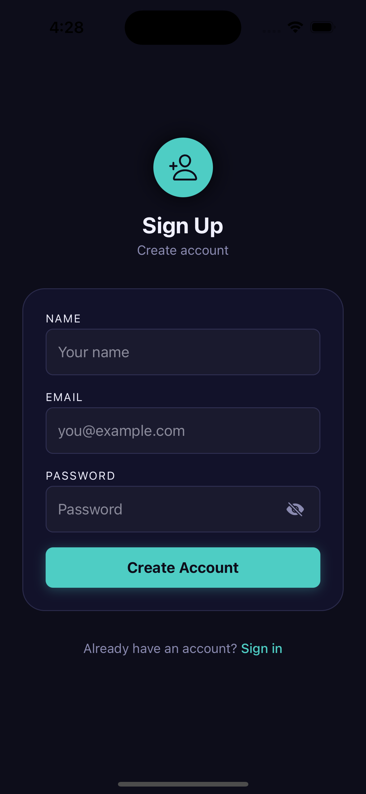
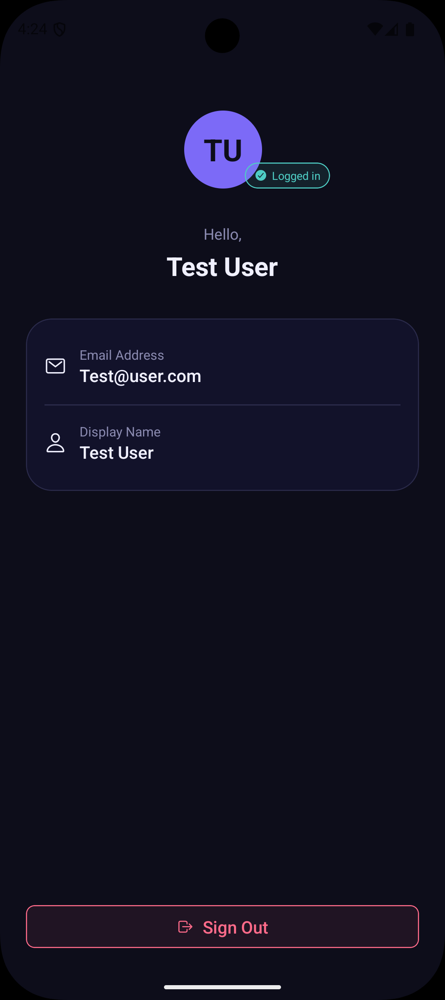
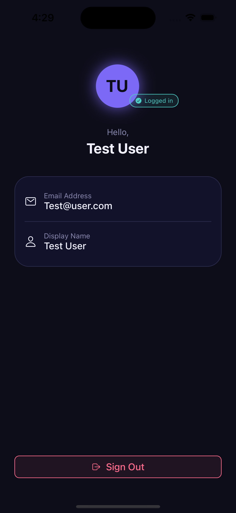

# AuthApp

A simple **React Native authentication app** built with **Expo and TypeScript**. This project demonstrates a basic **Login and Signup flow**, global authentication state using **React Context API**, and session persistence using **AsyncStorage**.

## Features

-   Login using email and password
-   Signup for new users
-   Authentication state managed using Context API
-   Local data storage using AsyncStorage
-   Protected navigation with React Navigation
-   Password show or hide toggle
-   Basic form validation and error messages
-   Simple dark themed UI

## Tech Stack

-   React Native (Expo)
-   TypeScript
-   React Context API
-   React Navigation
-   AsyncStorage

## Project Structure

    AuthApp/
    ├── App.tsx
    ├── README.md
    ├── package.json
    ├── screenshots/
    │   ├── android1.png
    │   ├── android2.png
    │   ├── android3.png
    │   ├── ios1.png
    │   ├── ios2.png
    │   └── ios3.png
    └── src/
        ├── components/
        ├── context/
        ├── hooks/
        ├── navigation/
        ├── screens/
        ├── types/
        └── utils/

## Screenshots

### Login Screen

| Android | iOS |
|---------|-----|
|  |  |

### Signup Screen

| Android | iOS |
|---------|-----|
|  |  |

### Home Screen

| Android | iOS |
|---------|-----|
|  |  |

## Setup Instructions

1.  Install dependencies

```
    npm install

2.  Start the project

```
    npm start

3.  Run the app

Press **a** for Android emulator\
Press **i** for iOS simulator\
Or scan the QR code using **Expo Go**

## App Flow

1.  User opens the app
2.  If a session exists in AsyncStorage, the user goes directly to the
    Home screen
3.  Otherwise the Login screen appears
4.  Users can login or create a new account
5.  After login, the Home screen shows user information with a logout
    option

------------------------------------------------------------------------

This project was created to practice **authentication flow, context based state management, navigation, and form handling in React Native**.
